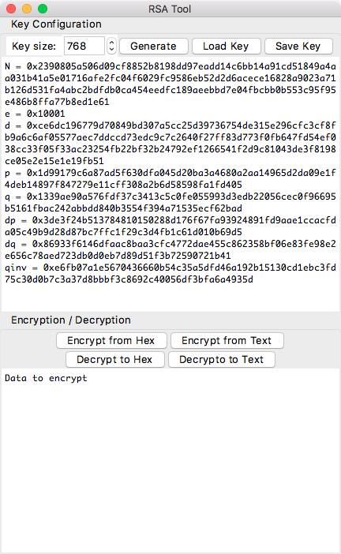

# RSA Tool

## What is this?

A RSA algorithm in pure python. Actually this is one of my homework! :

## Requirements

- Python2.7+ / Python3.5+
- Tkinter installed
- Only tested on macOS

## Credit

[pygubu](https://github.com/alejandroautalan/pygubu) - Tkinter GUI designer

## Warning

DO NOT use these code directly. You have to add random padding when using RSA algorithm. NEVER use
textbook RSA without padding!

ref: [https://crypto.stackexchange.com/questions/3608/why-is-padding-used-for-rsa-encryption-given-that-it-is-not-a-block-cipher](https://crypto.stackexchange.com/questions/3608/why-is-padding-used-for-rsa-encryption-given-that-it-is-not-a-block-cipher)

## Files

| Filename  | Description                      |
| :-------- | :------------------------------- |
| gui.py    | GUI version main program         |
| main.py   | commandline version main program |
| prime.py  | prime related functions          |
| rsa.py    | rsa algorithm functions          |
| tk.py     | tkinter wrapper                  |
| utils.py  | some utils function              |
| main.ui   | pygubu project file              |

## Usage

`python main.py` / `python gui.py`

## Screenshot



## Sample output

```
$ python3 main.py
INFO:rsa:generating p...
INFO:rsa:generating q...
Default key generated (1024 bits)
RSAKey {
       N = 0x2ed31e9a73f8ee0a878e8b5ba2fe1f9fb921e22352e50fd1ea41fffa55ab5ac02c12
           bfa0f26ba136ec3b51e2d6a01d092bb3bcf81bb88397a7dcee2267bcd9668a716caed3
           a5246d22fbc6db61e8748a908e792198c809b9b4d355e2abeac5ad6453cdf0b152b07b
           f911102540553e6173216c2ab2f296f413f5ef3453ae1db55,
       e = 0x10001,
       d = 0x1a9b6cb06765f41d9799b0268a1fcce87dd27b25875d11f83e1cf2cfd50e61ab0160
           45f3b6cce1f6cb95899a544af734d6d87370a88fd876bcb415bd072590834cd805b111
           0912374effcde09e8ac015ecf319594243d4a22c9587bbf957b0c8eddb754ad3e8db52
           eaa9b7be3e379278d5e80ef1f5db5286c3e98370ae0916801,
       p = 0x1a78e5db584cc7c293e432d9c968890fe2417e57cc6b820f0f83ab107432b314ae2d
           6f6f5e8f3f7dc5fd589e8cde8981bb19f1f50cd1ecb0712f9d254290771c1,
       q = 0x1c4d174a1d2dfe67208f1a5aee7cf5a6097989782952874b9b4de0b49f861161e426
           751ea798469f04850b569841a1c9b7e9bf36c55407069a3fa4a54d52a2695,
      dp = 0x16b1be9ca4be6e22a996e0e1448191bf4440d18783804727922d56e1ec3beabab7f7
           cba8b6702806334e5642d6919160de7e07a8052d92b450d478ec107cb9201,
      dq = 0x6ded8368fdae895d49ba904463d63cd49238e31f3a62b5e3977b08368eebd2d8c9ba
           1772dac94086aaa79d42de651068d755b8c4a5f59cd4a8904c9747a091f9,
    qinv = 0xb646bec8413b0dcd68b8cf5571f010cf1f439b116a6dc1e4e73dd6811476a2ad7cfe
           e6cadc23fe46e5752d56b63847d599c1077cc03edb2c5aee9b512eb3c20e,
}

  type `exit` or `q` to exit (or Ctrl-D in UNIX environment, Ctrl-Z in Windows)
  type `help` or `?` to see usage

RSA > prime 64
33284058117224894843
RSA > set e 33284058117224894843
RSA > keygen 2048
INFO:rsa:generating p...
INFO:rsa:generating q...
RSAKey {
       N = 0x23ebd40e21bdbc10c926ddf4e41cad71369e1625d50d2a6a5af6fb8b510e9ffb9c80
           0637fe14d90866f609e0e523cb3710d4ecf915e47944479692d87f3b4e9ae4a40a24e8
           d64294333cf27d8d1662e3c902407f8f8e0eb8d894d9c933dfa7b05b4cefbf582b624d
           fd2ff74d6088bde862efedc8a376893737dad3ff3293b7d387179d8ee3fdd2140dd9c3
           3cc00e1affd73ba64e95f5d9efd21b5110432303dc7bd119800cd035565e0058df4667
           6355975cf13a8795061cb0e2fd74dc48861cf436dff0dd3b8663941750a8322d63e4d1
           d6150006bf14a2ce390e18be7804494ca324da59db1f1f3305c12a7aef46016e61229e
           5fc1e5d336d428288718d511f,
       e = 0x1cde8ba82d8a5917b,
       d = 0xd2dc3bd422753205b6a01c5b4d6f347d7ac8a02529c68c6a3dad4ff2ed20fdf8d83a
           b9f37d22bf9728c4974fb1476b4a49fb0af80cd75453c5fdcb6abfe7c2a880e8b8119f
           5c06d099a0f9dfe0ba1fc5af9bf165e37edd9403fc5f960618a0179067b9872ffb3746
           ee1a483fc8030ca915780a13eaca198905c03b4a8464cf667a3387a74e6958c0991eb2
           e8f7b2d72360ca577dcf51e292e1c413b7249a3868beae4480fb2acaf2439b6dc10e87
           7ac1d9a682dc4ca8e95e812b1dca4e8849a54551b47b4f14b19b40b4fc826eb77944e8
           bb2aeab7631623dd0fcb84f06e23ce4120c6b8452fe2629843f9521d5bc8e4e7293669
           9595326e7e02d46fb3af51b3,
       p = 0x17f51841540e17f3e0f36143acd90e22fa8f9f0bda2a2cb7d86a81f4f86631fe0bc8
           9050f181f01273aaef7a3479ca2a05ed9c9988a410f6307a53cfbd50310235f5e41cce
           1dccff5d64be05ec24829422d7633704e08cebee2596e06ba590f9b1aa82435e4796b0
           94e88053f456d0634716d5dec87a19bb01d5a96219ebaa01f,
       q = 0x17fd73f525c618d08043c650549f73ba926f65fa4da99dc999673fedd0f8c3fbb121
           fc28f33892774a261998d0dabb792fa31fc90d29522c158d0711e1be46f0ac1a6d5364
           52900a01013b65acb785d55d081db791a16da7f11d078045c2cd6b8729e6fb44bb4d30
           2c16eb6f7c1320f4b79a8e40d13c1ae4978b4acc92ef32f01,
      dp = 0x16ddb4f0dd93c82eaa7cd5a3a489857f00f481a12cef2cb6f17bffee0cd0cefce5c4
           8ff756cc3f07a2adcb4d5747f649b43d4a909925cfbbcde194adf233090ebcf2789920
           eaf4490708ffdb7b15b6df0ec13c01476db43db949a232962298cafcb4e840ead19e14
           fe72b4cbc45562927c58392e954af5c3c064c3aea1e37d7e1,
      dq = 0x311ebd305bbff503cfee775a30b5cf075f919182086920b55283f81a1c99538c4031
           2123ab3393eccc6c7360757ee19d7aa30e93f50561f76a3ca3e19e89297acab4799c35
           ef49506c5fde58c50c33b1e8ce7e607e303d7c90b340803ca6ef0684e53a1c9c6185e1
           4d6b225465d13459531afccd0a6c47dd5aad9d3a75fc66b3,
    qinv = 0x3a9d6fac4f17adc24dd52e21d221c6c87a89094559bd83f9fa999433ab6bfa0466cf
           c43138ea23482153a6ed3a163a8c16bd485acd6034d71ac564674d9435101a31f9bfd9
           0ec581b2bf33f31dd2ad406130d1ade1f8812017dfb1050ec2c73a9def4079019a028e
           313e17948f246aa594d4ffd4bd1ef8fbd201d096c4eb0253,
}
RSA > dumpkey key2048
Key dumped to file key2048
RSA > enc rsa.py
Source data: b"import json\nimport logging\nimport textwrap\n\nimport prime\nfrom utils import *\n\nlogger = logging.getLogger('rsa')\n\ndef hex_or_none(x):\n    if type(x) in IntTypes:\n        return '0x%x' % x\n    else:\n        return None\n\nclass RSAKey(object):\n    KEYS = ['N',"...
Encrypted: b'68f4c647e13f01a5fa8fc1cba3c26ee6e6a850c9cc9c39a7e039b6d562de799a9b13812cbe96adff574faaf1c6cb6ae0c806dfbede7880b3c9b0d6013569e98bcd0c63be9a116a54e4a060a533b4fd6fb3289807421e16201b7976b3dc5928bb55bdce24388a6bc40196684a34c5070a3708f1b55c1fce6e6dfb7bc436959553a5b821bd206dbc6dc00617ad6dd3e145c5faf2872cb97e8b94299ea0a7aa7cb36dd3ae2768ca5a0c6e48d421ff98a8b4804e5bd4488ce89bb2207d38682ef0ad27942a457b3a983d6418c26e2f51c4a41b47fe52d2990233e35bcd619817970a0675adde7710c0edea6ef2e841aec793f699fd0eceb44c1a9681a4a1467ed419'...
RSA > dum
dump     dumpkey  dumpstr
RSA > dump rsa.py.enc
RSA > dec rsa.py.enc
INFO:rsa:CRT optimize are used
362.454 ms used
Source data: b"h\xf4\xc6G\xe1?\x01\xa5\xfa\x8f\xc1\xcb\xa3\xc2n\xe6\xe6\xa8P\xc9\xcc\x9c9\xa7\xe09\xb6\xd5b\xdey\x9a\x9b\x13\x81,\xbe\x96\xad\xffWO\xaa\xf1\xc6\xcbj\xe0\xc8\x06\xdf\xbe\xdex\x80\xb3\xc9\xb0\xd6\x015i\xe9\x8b\xcd\x0cc\xbe\x9a\x11jT\xe4\xa0`\xa53\xb4\xfdo\xb3(\x98\x07B\x1e\x16 \x1byv\xb3\xdcY(\xbbU\xbd\xce$8\x8ak\xc4\x01\x96hJ4\xc5\x07\n7\x08\xf1\xb5\\\x1f\xcenm\xfb{\xc46\x95\x95S\xa5\xb8!\xbd m\xbcm\xc0\x06\x17\xadm\xd3\xe1E\xc5\xfa\xf2\x87,\xb9~\x8b\x94)\x9e\xa0\xa7\xaa|\xb3m\xd3\xae'h\xcaZ\x0cnH\xd4!\xff\x98\xa8\xb4\x80N[\xd4H\x8c\xe8\x9b\xb2 }8h.\xf0\xad'\x94*E{:\x98=d\x18\xc2n/Q\xc4\xa4\x1bG\xfeR\xd2\x99\x023\xe3[\xcda\x98\x17\x97\n\x06u\xad\xdew\x10\xc0\xed\xean\xf2\xe8A\xae\xc7\x93\xf6\x99\xfd\x0e\xce\xb4L\x1a\x96\x81\xa4\xa1F~\xd4\x19"...
Decrypted: b"import json\nimport logging\nimport textwrap\n\nimport prime\nfrom utils import *\n\nlogger = logging.getLogger('rsa')\n\ndef hex_or_none(x):\n    if type(x) in IntTypes:\n        return '0x%x' % x\n    else:\n        return None\n\nclass RSAKey(object):\n    KEYS = ['N',"...
RSA > simplify
RSAKey {
       N = 0x23ebd40e21bdbc10c926ddf4e41cad71369e1625d50d2a6a5af6fb8b510e9ffb9c80
           0637fe14d90866f609e0e523cb3710d4ecf915e47944479692d87f3b4e9ae4a40a24e8
           d64294333cf27d8d1662e3c902407f8f8e0eb8d894d9c933dfa7b05b4cefbf582b624d
           fd2ff74d6088bde862efedc8a376893737dad3ff3293b7d387179d8ee3fdd2140dd9c3
           3cc00e1affd73ba64e95f5d9efd21b5110432303dc7bd119800cd035565e0058df4667
           6355975cf13a8795061cb0e2fd74dc48861cf436dff0dd3b8663941750a8322d63e4d1
           d6150006bf14a2ce390e18be7804494ca324da59db1f1f3305c12a7aef46016e61229e
           5fc1e5d336d428288718d511f,
       e = 0x1cde8ba82d8a5917b,
       d = 0xd2dc3bd422753205b6a01c5b4d6f347d7ac8a02529c68c6a3dad4ff2ed20fdf8d83a
           b9f37d22bf9728c4974fb1476b4a49fb0af80cd75453c5fdcb6abfe7c2a880e8b8119f
           5c06d099a0f9dfe0ba1fc5af9bf165e37edd9403fc5f960618a0179067b9872ffb3746
           ee1a483fc8030ca915780a13eaca198905c03b4a8464cf667a3387a74e6958c0991eb2
           e8f7b2d72360ca577dcf51e292e1c413b7249a3868beae4480fb2acaf2439b6dc10e87
           7ac1d9a682dc4ca8e95e812b1dca4e8849a54551b47b4f14b19b40b4fc826eb77944e8
           bb2aeab7631623dd0fcb84f06e23ce4120c6b8452fe2629843f9521d5bc8e4e7293669
           9595326e7e02d46fb3af51b3,
       p = None
       q = None
      dp = None
      dq = None
    qinv = None
}
RSA > dec rsa.py.enc
1171.58 ms used
Source data: b"h\xf4\xc6G\xe1?\x01\xa5\xfa\x8f\xc1\xcb\xa3\xc2n\xe6\xe6\xa8P\xc9\xcc\x9c9\xa7\xe09\xb6\xd5b\xdey\x9a\x9b\x13\x81,\xbe\x96\xad\xffWO\xaa\xf1\xc6\xcbj\xe0\xc8\x06\xdf\xbe\xdex\x80\xb3\xc9\xb0\xd6\x015i\xe9\x8b\xcd\x0cc\xbe\x9a\x11jT\xe4\xa0`\xa53\xb4\xfdo\xb3(\x98\x07B\x1e\x16 \x1byv\xb3\xdcY(\xbbU\xbd\xce$8\x8ak\xc4\x01\x96hJ4\xc5\x07\n7\x08\xf1\xb5\\\x1f\xcenm\xfb{\xc46\x95\x95S\xa5\xb8!\xbd m\xbcm\xc0\x06\x17\xadm\xd3\xe1E\xc5\xfa\xf2\x87,\xb9~\x8b\x94)\x9e\xa0\xa7\xaa|\xb3m\xd3\xae'h\xcaZ\x0cnH\xd4!\xff\x98\xa8\xb4\x80N[\xd4H\x8c\xe8\x9b\xb2 }8h.\xf0\xad'\x94*E{:\x98=d\x18\xc2n/Q\xc4\xa4\x1bG\xfeR\xd2\x99\x023\xe3[\xcda\x98\x17\x97\n\x06u\xad\xdew\x10\xc0\xed\xean\xf2\xe8A\xae\xc7\x93\xf6\x99\xfd\x0e\xce\xb4L\x1a\x96\x81\xa4\xa1F~\xd4\x19"...
Decrypted: b"import json\nimport logging\nimport textwrap\n\nimport prime\nfrom utils import *\n\nlogger = logging.getLogger('rsa')\n\ndef hex_or_none(x):\n    if type(x) in IntTypes:\n        return '0x%x' % x\n    else:\n        return None\n\nclass RSAKey(object):\n    KEYS = ['N',"...
RSA > exit
$ python3 main.py
INFO:rsa:generating p...
INFO:rsa:generating q...
Default key generated (1024 bits)
RSAKey {
       N = 0x332689d2fd248beb0a738ce7cbdce2a4522a222bf67556b7684147c5521b8ce2a450
           a7534c27b8dee754fd273663eb45987a3ddbb7cf8a76dfd1f6f1b9bbfe251378f35f75
           7c86cdcc901906e28a14156aa2cde85362c96fde393e2412f96865dad05122c8482379
           978f75a40827b68d1f5d1e43a246cfbe941b28b6c01755c75,
       e = 0x10001,
       d = 0x94a76be5c3cc72d6a3892df87a81782c169e5cb167939c716a8c4e092896e8dbc4ae
           a19b73b7fd8fd2bf2cfac9179aaaa8789b4df2e5378442f5f2b89111c98950baf3dada
           7209c91dd04556b75e56f3429437060cf999c7c540eb6f58114d1be9fd4a165a690be9
           e1e75565adf6c15bebf3eb583bdd772fd4c42c89847a4001,
       p = 0x1d424166d2589754cdfbe51e269d02437d3ef101e9f1e735c1eeb5003aac3800aaaf
           be04efeca811ed140935a7aec9f1d8bd1dc71d775c7e59d9ca5559d4409a1,
       q = 0x1bf8aae35ee87225540cd7fc59f6573739f06e3db7e49dd68abb288f1be9dec93e33
           6dedcbcc8c7f6eac8db438c739ea2ec698204043dacd8b79cc0a1b971ea55,
      dp = 0xd7a50c03992ff9adc0bf5ddeeb192b25e065964a54c7e52201482a22964dda348fd0
           d8e1eab283ca1b6020c0a4314d9681aad95e437f08e6f7b489e0a7420921,
      dq = 0x17ffc56f8c30d82f1aec622c8c6b85ed4672f9c34e9282b25f19b1f507b823847b2f
           d933dc56467dd7d1894b8623b9972a470ea32d408aed2cac75da7e4dace79,
    qinv = 0x679ec749f948bcd61632cfd7c228f3b3ba0e433ef6284e34ae61a3d260511f90190a
           b7dc693f0d13b00d0028ec029f2a2c1d0de0e1cc772c00fb7bc6a9536e57,
}

  type `exit` or `q` to exit (or Ctrl-D in UNIX environment, Ctrl-Z in Windows)
  type `help` or `?` to see usage

RSA > loadkey key2048
RSAKey {
       N = 0x23ebd40e21bdbc10c926ddf4e41cad71369e1625d50d2a6a5af6fb8b510e9ffb9c80
           0637fe14d90866f609e0e523cb3710d4ecf915e47944479692d87f3b4e9ae4a40a24e8
           d64294333cf27d8d1662e3c902407f8f8e0eb8d894d9c933dfa7b05b4cefbf582b624d
           fd2ff74d6088bde862efedc8a376893737dad3ff3293b7d387179d8ee3fdd2140dd9c3
           3cc00e1affd73ba64e95f5d9efd21b5110432303dc7bd119800cd035565e0058df4667
           6355975cf13a8795061cb0e2fd74dc48861cf436dff0dd3b8663941750a8322d63e4d1
           d6150006bf14a2ce390e18be7804494ca324da59db1f1f3305c12a7aef46016e61229e
           5fc1e5d336d428288718d511f,
       e = 0x1cde8ba82d8a5917b,
       d = 0xd2dc3bd422753205b6a01c5b4d6f347d7ac8a02529c68c6a3dad4ff2ed20fdf8d83a
           b9f37d22bf9728c4974fb1476b4a49fb0af80cd75453c5fdcb6abfe7c2a880e8b8119f
           5c06d099a0f9dfe0ba1fc5af9bf165e37edd9403fc5f960618a0179067b9872ffb3746
           ee1a483fc8030ca915780a13eaca198905c03b4a8464cf667a3387a74e6958c0991eb2
           e8f7b2d72360ca577dcf51e292e1c413b7249a3868beae4480fb2acaf2439b6dc10e87
           7ac1d9a682dc4ca8e95e812b1dca4e8849a54551b47b4f14b19b40b4fc826eb77944e8
           bb2aeab7631623dd0fcb84f06e23ce4120c6b8452fe2629843f9521d5bc8e4e7293669
           9595326e7e02d46fb3af51b3,
       p = 0x17f51841540e17f3e0f36143acd90e22fa8f9f0bda2a2cb7d86a81f4f86631fe0bc8
           9050f181f01273aaef7a3479ca2a05ed9c9988a410f6307a53cfbd50310235f5e41cce
           1dccff5d64be05ec24829422d7633704e08cebee2596e06ba590f9b1aa82435e4796b0
           94e88053f456d0634716d5dec87a19bb01d5a96219ebaa01f,
       q = 0x17fd73f525c618d08043c650549f73ba926f65fa4da99dc999673fedd0f8c3fbb121
           fc28f33892774a261998d0dabb792fa31fc90d29522c158d0711e1be46f0ac1a6d5364
           52900a01013b65acb785d55d081db791a16da7f11d078045c2cd6b8729e6fb44bb4d30
           2c16eb6f7c1320f4b79a8e40d13c1ae4978b4acc92ef32f01,
      dp = 0x16ddb4f0dd93c82eaa7cd5a3a489857f00f481a12cef2cb6f17bffee0cd0cefce5c4
           8ff756cc3f07a2adcb4d5747f649b43d4a909925cfbbcde194adf233090ebcf2789920
           eaf4490708ffdb7b15b6df0ec13c01476db43db949a232962298cafcb4e840ead19e14
           fe72b4cbc45562927c58392e954af5c3c064c3aea1e37d7e1,
      dq = 0x311ebd305bbff503cfee775a30b5cf075f919182086920b55283f81a1c99538c4031
           2123ab3393eccc6c7360757ee19d7aa30e93f50561f76a3ca3e19e89297acab4799c35
           ef49506c5fde58c50c33b1e8ce7e607e303d7c90b340803ca6ef0684e53a1c9c6185e1
           4d6b225465d13459531afccd0a6c47dd5aad9d3a75fc66b3,
    qinv = 0x3a9d6fac4f17adc24dd52e21d221c6c87a89094559bd83f9fa999433ab6bfa0466cf
           c43138ea23482153a6ed3a163a8c16bd485acd6034d71ac564674d9435101a31f9bfd9
           0ec581b2bf33f31dd2ad406130d1ade1f8812017dfb1050ec2c73a9def4079019a028e
           313e17948f246aa594d4ffd4bd1ef8fbd201d096c4eb0253,
}
Key loaded
RSA > dec rsa.py.enc
INFO:rsa:CRT optimize are used
367.109 ms used
Source data: b"h\xf4\xc6G\xe1?\x01\xa5\xfa\x8f\xc1\xcb\xa3\xc2n\xe6\xe6\xa8P\xc9\xcc\x9c9\xa7\xe09\xb6\xd5b\xdey\x9a\x9b\x13\x81,\xbe\x96\xad\xffWO\xaa\xf1\xc6\xcbj\xe0\xc8\x06\xdf\xbe\xdex\x80\xb3\xc9\xb0\xd6\x015i\xe9\x8b\xcd\x0cc\xbe\x9a\x11jT\xe4\xa0`\xa53\xb4\xfdo\xb3(\x98\x07B\x1e\x16 \x1byv\xb3\xdcY(\xbbU\xbd\xce$8\x8ak\xc4\x01\x96hJ4\xc5\x07\n7\x08\xf1\xb5\\\x1f\xcenm\xfb{\xc46\x95\x95S\xa5\xb8!\xbd m\xbcm\xc0\x06\x17\xadm\xd3\xe1E\xc5\xfa\xf2\x87,\xb9~\x8b\x94)\x9e\xa0\xa7\xaa|\xb3m\xd3\xae'h\xcaZ\x0cnH\xd4!\xff\x98\xa8\xb4\x80N[\xd4H\x8c\xe8\x9b\xb2 }8h.\xf0\xad'\x94*E{:\x98=d\x18\xc2n/Q\xc4\xa4\x1bG\xfeR\xd2\x99\x023\xe3[\xcda\x98\x17\x97\n\x06u\xad\xdew\x10\xc0\xed\xean\xf2\xe8A\xae\xc7\x93\xf6\x99\xfd\x0e\xce\xb4L\x1a\x96\x81\xa4\xa1F~\xd4\x19"...
Decrypted: b"import json\nimport logging\nimport textwrap\n\nimport prime\nfrom utils import *\n\nlogger = logging.getLogger('rsa')\n\ndef hex_or_none(x):\n    if type(x) in IntTypes:\n        return '0x%x' % x\n    else:\n        return None\n\nclass RSAKey(object):\n    KEYS = ['N',"...
RSA > dum
dump     dumpkey  dumpstr
RSA > dump
b'696d706f7274206a736f6e0a696d706f7274206c6f6767696e670a696d706f72742074657874777261700a0a696d706f7274207072696d650a66726f6d207574696c7320696d706f7274202a0a0a6c6f67676572203d206c6f6767696e672e6765744c6f67676572282772736127290a0a646566206865785f6f725f6e6f6e652878293a0a202020206966207479706528782920696e20496e7454797065733a0a202020202020202072657475726e20273078257827202520780a20202020656c73653a0a202020202020202072657475726e204e6f6e650a0a636c617373205253414b6579286f626a656374293a0a202020204b455953203d205b274e272c202765272c202764272c202770272c202771272c20276470272c20276471272c202771696e76275d0a0a20202020407374617469636d6574686f640a202020206465662066726f6d5f6a736f6e286a736f6e5f737472293a0a20202020202020206465662061735f696e742878293a0a202020202020202020202020696620782e737461727473776974682827307827293a0a2020202020202020202020202020202072657475726e20696e7428782c203136290a202020202020202020202020656c73653a0a2020202020202020202020202020202072657475726e20696e7428782c203130290a202020202020202064203d207b206b3a2061735f696e7428762920666f72206b2c207620696e206a736f6e2e6c6f616473286a736f6e5f737472292e6974656d732829207d0a202020202020202072657475726e205253414b6579282a2a64290a0a20202020646566205f5f696e69745f5f2873656c662c204e3d4e6f6e652c20653d4e6f6e652c20643d4e6f6e652c20703d4e6f6e652c20713d4e6f6e652c2064703d4e6f6e652c2064713d4e6f6e652c2071696e763d4e6f6e652c20626974733d4e6f6e65293a0a20202020202020202222220a20202020202020204f6e65206f6620666f6c6c6f77696e6720736574206f6620706172616d6574657273206d75737420626520676976656e3a0a202020202020202020202020284e2c2065292c20284e2c2064292c202864702c2064712c2071696e76292c2028652c20702c2071292c202862697473290a20202020202020202222220a202020202020202073656c662e70203d2073656c662e71203d2073656c662e706869203d2073656c662e6470203d2073656c662e6471203d2073656c662e65203d204e6f6e650a0a20202020202020206966207020213d204e6f6e6520616e64207120213d204e6f6e653a0a20202020202020202020202073656c662e702c2073656c662e71203d20702c20710a20202020202020202020202073656c662e706869203d202870202d203129202a202871202d2031290a20202020202020202020202073656c662e4e203d2070202a20710a2020202020202020656c6966204e20213d204e6f6e653a0a20202020202020202020202073656c662e4e203d204e0a2020202020202020656c6966206269747320213d204e6f6e653a0a20202020202020202020202073656c662e65203d20307831303030310a20202020202020202020202073656c662e67656e5f70712862697473290a2020202020202020656c73653a0a20202020202020202020202072616973652056616c75654572726f7228274e206f722028702c207129206f722062697473206d75737420626520676976656e27290a0a20202020202020206966206520213d204e6f6e653a0a20202020202020202020202073656c662e65203d20650a0a2020202020202020696620643a0a20202020202020202020202073656c662e64203d20640a2020202020202020656c69662073656c662e7068693a0a20202020202020202020202073656c662e64203d206d6f64696e762873656c662e652c2073656c662e706869290a2020202020202020656c73653a0a20202020202020202020202073656c662e706869203d2073656c662e64203d204e6f6e650a0a2020202020202020696620647020616e642064713a0a20202020202020202020202073656c662e6470203d2064700a20202020202020202020202073656c662e6471203d2064710a2020202020202020656c69662073656c662e7020616e642073656c662e713a0a20202020202020202020202073656c662e6470203d206d6f64696e762873656c662e652c2073656c662e70202d2031290a20202020202020202020202073656c662e6471203d206d6f64696e762873656c662e652c2073656c662e71202d2031290a0a202020202020202069662073656c662e647020616e642073656c662e64713a0a20202020202020202020202069662071696e763a0a2020202020202020202020202020202073656c662e71696e76203d2071696e760a202020202020202020202020656c69662073656c662e7020616e642073656c662e713a0a2020202020202020202020202020202073656c662e71696e76203d206d6f64696e762873656c662e712c2073656c662e70290a202020202020202020202020656c73653a0a2020202020202020202020202020202072616973652056616c75654572726f72282764702c206471207765726520676976656e2c206275742063616e206e6f7420636f6d707574652071696e7627290a0a20202020202020206966206e6f742073656c662e5f63616e5f646563727970743a2023206174206c6173742c20776520617373756d652065203d2036353533370a20202020202020202020202073656c662e65203d20307831303030310a0a202020206465662067656e5f70712873656c662c2062697473293a0a20202020202020202222220a202020202020202067656e6572617465206b6579706169722028702c2071290a20202020202020202222220a20202020202020206173736572742062697473203e3d203531322c20276b6579206c656e677468206d757374206265206174206c65617374203531322062697473270a20202020202020206c203d2062697473203e3e20310a0a20202020202020206c6f676765722e696e666f282767656e65726174696e6720702e2e2e27290a20202020202020207768696c6520547275653a0a20202020202020202020202070203d207072696d652e72616e647072696d655f62697473286c290a2020202020202020202020206c6f676765722e64656275672827702067656e6572617465642c207265636865636b696e672e2e2e27290a2020202020202020202020206966207072696d652e69735f70726f6261626c655f7072696d6528702c204e6f6e652c206c202f2f2038293a0a20202020202020202020202020202020627265616b0a2020202020202020202020206c6f676765722e646562756728277265636865636b206661696c65642e2072652d67656e6572617465207027290a0a20202020202020206c6f676765722e696e666f282767656e65726174696e6720712e2e2e27290a20202020202020207768696c6520547275653a0a20202020202020202020202071203d207072696d652e72616e647072696d655f626974732862697473202d206c290a2020202020202020202020206c6f676765722e64656275672827712067656e6572617465642c207265636865636b696e672e2e2e27290a2020202020202020202020206966207020213d207120616e64207072696d652e69735f70726f6261626c655f7072696d6528712c204e6f6e652c206c202f2f2038293a0a20202020202020202020202020202020627265616b0a2020202020202020202020206c6f676765722e646562756728277265636865636b206661696c65642e2072652d67656e6572617465207127290a0a202020202020202073656c662e70203d20700a202020202020202073656c662e71203d20710a202020202020202073656c662e4e203d2070202a20710a202020202020202073656c662e706869203d202870202d203129202a202871202d2031290a0a202020204070726f70657274790a20202020646566205f63616e5f656e63727970742873656c66293a0a202020202020202072657475726e2073656c662e4e20616e642073656c662e650a0a202020204070726f70657274790a20202020646566205f63616e5f646563727970742873656c66293a0a202020202020202072657475726e2073656c662e4e20616e642073656c662e640a0a202020204070726f70657274790a20202020646566205f63616e5f6372742873656c66293a0a202020202020202072657475726e2073656c662e4e20616e642073656c662e647120616e642073656c662e647020616e642073656c662e71696e7620616e642073656c662e7020616e642073656c662e710a0a202020204070726f70657274790a2020202064656620626c6f636b5f73697a652873656c66293a0a202020202020202072657475726e202873656c662e4e2e6269745f6c656e6774682829202b203729203e3e20330a0a20202020646566205f5f726570725f5f2873656c66293a0a202020202020202072657475726e20275253414b65792825732927202520272c20272e6a6f696e282725733d257327202520286b2c206865785f6f725f6e6f6e6528676574617474722873656c662c206b2c204e6f6e6529292920666f72206b20696e2073656c662e4b455953290a0a202020206465662061735f646963742873656c66293a0a20202020202020202222220a202020202020202064756d702074686973206b6579206f626a6563742061732064696374206f626a6563740a20202020202020202222220a202020202020202072657475726e207b206b3a206865785f6f725f6e6f6e6528676574617474722873656c662c206b2c204e6f6e65292920666f72206b20696e2073656c662e4b455953207d0a0a2020202064656620746f5f6a736f6e2873656c66293a0a20202020202020202222220a202020202020202064756d702074686973206b6579206f626a656374206173204a534f4e0a20202020202020202222220a202020202020202072657475726e206a736f6e2e64756d70732873656c662e61735f646963742829290a0a202020206465662064756d702873656c66293a0a20202020202020202222220a20202020202020207072696e74206669656c6473206f662074686973206b6579206f626a65637420746f207374646f75740a20202020202020202222220a202020202020202064656620707265665f67656e657261746f7228686561646c696e65293a0a2020202020202020202020207969656c6420686561646c696e650a20202020202020202020202070726566737063203d20272027202a206c656e28686561646c696e65290a2020202020202020202020207768696c6520547275653a0a202020202020202020202020202020207969656c6420707265667370630a0a20202020202020206465662064756d705f6174747228617474726e616d652c206964656e743d34293a0a20202020202020202020202076616c203d20676574617474722873656c662c20617474726e616d652c204e6f6e65290a2020202020202020202020206966206e6f742076616c3a0a202020202020202020202020202020207072696e7428272027202a206964656e74202b2027253473203d204e6f6e6527202520617474726e616d65290a202020202020202020202020656c73653a0a20202020202020202020202020202020686561646c696e65203d20272027202a206964656e74202b2027253473203d2027202520617474726e616d650a202020202020202020202020202020207072696e7428275c6e272e6a6f696e2870202b206920666f7220702c206920696e207a697028707265665f67656e657261746f7228686561646c696e65292c2074657874777261702e777261702827307825782c2720252076616c292929290a20202020202020207072696e7428275253414b6579207b27290a2020202020202020666f72206174747220696e2073656c662e4b4559533a0a20202020202020202020202064756d705f617474722861747472290a20202020202020207072696e7428277d27290a0a202020206465662073696d706c6966792873656c66293a0a20202020202020202222220a202020202020202072657475726e2073696d706c6966696564205253414b6579206f626a65637420286f6e6c79207b4e2c20652c20647d206669656c6473290a20202020202020202222220a202020202020202072657475726e205253414b6579284e3d73656c662e4e2c20653d73656c662e652c20643d73656c662e64290a0a0a636c61737320525341286f626a656374293a0a20202020646566205f5f696e69745f5f2873656c662c206b65793d4e6f6e652c20626974733d31303234293a0a20202020202020206966206b657920213d204e6f6e653a0a20202020202020202020202073656c662e6b6579203d206b65790a2020202020202020656c73653a0a20202020202020202020202073656c662e6b6579203d205253414b657928626974733d62697473290a0a2020202064656620656e63727970742873656c662c206d7367293a0a20202020202020202222220a20202020202020206d736720202020206c6974746c652d656e6469616e206f726465726564206279746573206f7220696e740a20202020202020202222220a20202020202020206966206e6f742073656c662e6b65792e5f63616e5f656e63727970743a0a2020202020202020202020207261697365204174747269627574654572726f72282754686973206b6579206f626a6563742063616e206e6f7420646f20656e6372797074696f6e27290a202020202020202069662074797065286d736729206973206e6f7420696e743a0a2020202020202020202020206d7367203d20627974657332696e7428656e737572655f6279746573286d736729290a0a202020202020202072657475726e2066706f77286d73672c2073656c662e6b65792e652c2073656c662e6b65792e4e290a0a2020202064656620646563727970742873656c662c206d73672c207573654352543d46616c7365293a0a20202020202020202222220a20202020202020206d736720202020206c6974746c652d656e6469616e206f726465726564206279746573206f7220696e740a20202020202020202222220a20202020202020206966206e6f742073656c662e6b65792e5f63616e5f646563727970743a0a2020202020202020202020207261697365204174747269627574654572726f72282754686973206b6579206f626a6563742063616e206e6f7420646f2064656372797074696f6e27290a202020202020202069662074797065286d736729206973206e6f7420696e743a0a2020202020202020202020206d7367203d20627974657332696e7428656e737572655f6279746573286d736729290a0a202020202020202069662073656c662e6b65792e5f63616e5f6372743a0a20202020202020202020202072657475726e2073656c662e5f6372745f64656372797074286d7367290a2020202020202020656c6966207573654352543a0a202020202020202020202020726169736520457863657074696f6e2827435254206f7074696d697a65206e6f7420617661696c61626c6520666f722074686973206b6579206f626a65637427290a2020202020202020656c73653a0a20202020202020202020202072657475726e2066706f77286d73672c2073656c662e6b65792e642c2073656c662e6b65792e4e290a0a20202020646566205f6372745f646563727970742873656c662c206d7367293a0a20202020202020206d31203d2066706f77286d736720252073656c662e6b65792e702c2073656c662e6b65792e64702c2073656c662e6b65792e70290a20202020202020206d32203d2066706f77286d736720252073656c662e6b65792e712c2073656c662e6b65792e64712c2073656c662e6b65792e71290a20202020202020206b203d202873656c662e6b65792e71696e76202a20286d31202d206d32202b2073656c662e6b65792e70292920252073656c662e6b65792e700a202020202020202072657475726e206d32202b206b202a2073656c662e6b65792e710a0a2020202064656620656e63727970745f626c6f636b2873656c662c206d7367293a0a202020202020202072657475726e20696e743262797465732873656c662e656e6372797074286d7367292c2073656c662e6b65792e626c6f636b5f73697a65290a0a2020202064656620646563727970745f626c6f636b2873656c662c206d73672c207573654352543d46616c7365293a0a202020202020202072657475726e20696e743262797465732873656c662e64656372797074286d7367292c2073656c662e6b65792e626c6f636b5f73697a65202d2031290a0a2020202064656620656e63727970745f646174612873656c662c2064617461293a0a20202020202020206273203d2073656c662e6b65792e626c6f636b5f73697a65202d20310a2020202020202020646174615f73747265616d203d2028646174615b693a692b62735d20666f72206920696e2072616e676528302c206c656e2864617461292c20627329290a202020202020202072657475726e206227272e6a6f696e2873656c662e656e63727970745f626c6f636b28626c6f636b2920666f7220626c6f636b20696e20646174615f73747265616d290a0a2020202064656620646563727970745f646174612873656c662c2064617461293a0a2020202020202020757365435254203d2073656c662e6b65792e5f63616e5f6372740a20202020202020206966207573654352543a0a2020202020202020202020206c6f676765722e696e666f2827435254206f7074696d697a6520617265207573656427290a0a20202020202020206273203d2073656c662e6b65792e626c6f636b5f73697a650a2020202020202020646174615f73747265616d203d2028646174615b693a692b62735d20666f72206920696e2072616e676528302c206c656e2864617461292c20627329290a202020202020202072657475726e206227272e6a6f696e2873656c662e646563727970745f626c6f636b28626c6f636b2c20757365435254295b3a62732d315d20666f7220626c6f636b20696e20646174615f73747265616d292e7273747269702862275c78303027290a0a6465662072616e646f6d5f737472286c293a0a20202020696d706f7274206f730a2020202072657475726e204279746573286279746561727261792830783230202b20692025202830783766202d20307832302920666f72206920696e20627974656172726179286f732e7572616e646f6d286c292929290a0a6966205f5f6e616d655f5f203d3d20275f5f6d61696e5f5f273a0a20202020696d706f7274207379730a202020206c6f6767696e672e6261736963436f6e6669672873747265616d3d7379732e7374646f75742c206c6576656c3d6c6f6767696e672e4445425547290a0a20202020636970686572203d2052534128626974733d32303438290a202020207072696e7428274b65793a27290a202020206369706865722e6b65792e64756d7028290a2020202073203d2072616e646f6d5f737472283634290a202020207072696e74282752616e646f6d205374723a2025732720252073290a2020202063203d206369706865722e656e63727970745f646174612873290a202020207072696e742827456e637279707465643a202025732720252063290a202020206d203d206369706865722e646563727970745f646174612863290a202020207072696e7428274465637279707465643a20202573272025206d290a'
RSA > dumpstr
b'import json\nimport logging\nimport textwrap\n\nimport prime\nfrom utils import *\n\nlogger = logging.getLogger(\'rsa\')\n\ndef hex_or_none(x):\n    if type(x) in IntTypes:\n        return \'0x%x\' % x\n    else:\n        return None\n\nclass RSAKey(object):\n    KEYS = [\'N\', \'e\', \'d\', \'p\', \'q\', \'dp\', \'dq\', \'qinv\']\n\n    @staticmethod\n    def from_json(json_str):\n        def as_int(x):\n            if x.startswith(\'0x\'):\n                return int(x, 16)\n            else:\n                return int(x, 10)\n        d = { k: as_int(v) for k, v in json.loads(json_str).items() }\n        return RSAKey(**d)\n\n    def __init__(self, N=None, e=None, d=None, p=None, q=None, dp=None, dq=None, qinv=None, bits=None):\n        """\n        One of following set of parameters must be given:\n            (N, e), (N, d), (dp, dq, qinv), (e, p, q), (bits)\n        """\n        self.p = self.q = self.phi = self.dp = self.dq = self.e = None\n\n        if p != None and q != None:\n            self.p, self.q = p, q\n            self.phi = (p - 1) * (q - 1)\n            self.N = p * q\n        elif N != None:\n            self.N = N\n        elif bits != None:\n            self.e = 0x10001\n            self.gen_pq(bits)\n        else:\n            raise ValueError(\'N or (p, q) or bits must be given\')\n\n        if e != None:\n            self.e = e\n\n        if d:\n            self.d = d\n        elif self.phi:\n            self.d = modinv(self.e, self.phi)\n        else:\n            self.phi = self.d = None\n\n        if dp and dq:\n            self.dp = dp\n            self.dq = dq\n        elif self.p and self.q:\n            self.dp = modinv(self.e, self.p - 1)\n            self.dq = modinv(self.e, self.q - 1)\n\n        if self.dp and self.dq:\n            if qinv:\n                self.qinv = qinv\n            elif self.p and self.q:\n                self.qinv = modinv(self.q, self.p)\n            else:\n                raise ValueError(\'dp, dq were given, but can not compute qinv\')\n\n        if not self._can_decrypt: # at last, we assume e = 65537\n            self.e = 0x10001\n\n    def gen_pq(self, bits):\n        """\n        generate keypair (p, q)\n        """\n        assert bits >= 512, \'key length must be at least 512 bits\'\n        l = bits >> 1\n\n        logger.info(\'generating p...\')\n        while True:\n            p = prime.randprime_bits(l)\n            logger.debug(\'p generated, rechecking...\')\n            if prime.is_probable_prime(p, None, l // 8):\n                break\n            logger.debug(\'recheck failed. re-generate p\')\n\n        logger.info(\'generating q...\')\n        while True:\n            q = prime.randprime_bits(bits - l)\n            logger.debug(\'q generated, rechecking...\')\n            if p != q and prime.is_probable_prime(q, None, l // 8):\n                break\n            logger.debug(\'recheck failed. re-generate q\')\n\n        self.p = p\n        self.q = q\n        self.N = p * q\n        self.phi = (p - 1) * (q - 1)\n\n    @property\n    def _can_encrypt(self):\n        return self.N and self.e\n\n    @property\n    def _can_decrypt(self):\n        return self.N and self.d\n\n    @property\n    def _can_crt(self):\n        return self.N and self.dq and self.dp and self.qinv and self.p and self.q\n\n    @property\n    def block_size(self):\n        return (self.N.bit_length() + 7) >> 3\n\n    def __repr__(self):\n        return \'RSAKey(%s)\' % \', \'.join(\'%s=%s\' % (k, hex_or_none(getattr(self, k, None))) for k in self.KEYS)\n\n    def as_dict(self):\n        """\n        dump this key object as dict object\n        """\n        return { k: hex_or_none(getattr(self, k, None)) for k in self.KEYS }\n\n    def to_json(self):\n        """\n        dump this key object as JSON\n        """\n        return json.dumps(self.as_dict())\n\n    def dump(self):\n        """\n        print fields of this key object to stdout\n        """\n        def pref_generator(headline):\n            yield headline\n            prefspc = \' \' * len(headline)\n            while True:\n                yield prefspc\n\n        def dump_attr(attrname, ident=4):\n            val = getattr(self, attrname, None)\n            if not val:\n                print(\' \' * ident + \'%4s = None\' % attrname)\n            else:\n                headline = \' \' * ident + \'%4s = \' % attrname\n                print(\'\\n\'.join(p + i for p, i in zip(pref_generator(headline), textwrap.wrap(\'0x%x,\' % val))))\n        print(\'RSAKey {\')\n        for attr in self.KEYS:\n            dump_attr(attr)\n        print(\'}\')\n\n    def simplify(self):\n        """\n        return simplified RSAKey object (only {N, e, d} fields)\n        """\n        return RSAKey(N=self.N, e=self.e, d=self.d)\n\n\nclass RSA(object):\n    def __init__(self, key=None, bits=1024):\n        if key != None:\n            self.key = key\n        else:\n            self.key = RSAKey(bits=bits)\n\n    def encrypt(self, msg):\n        """\n        msg     little-endian ordered bytes or int\n        """\n        if not self.key._can_encrypt:\n            raise AttributeError(\'This key object can not do encryption\')\n        if type(msg) is not int:\n            msg = bytes2int(ensure_bytes(msg))\n\n        return fpow(msg, self.key.e, self.key.N)\n\n    def decrypt(self, msg, useCRT=False):\n        """\n        msg     little-endian ordered bytes or int\n        """\n        if not self.key._can_decrypt:\n            raise AttributeError(\'This key object can not do decryption\')\n        if type(msg) is not int:\n            msg = bytes2int(ensure_bytes(msg))\n\n        if self.key._can_crt:\n            return self._crt_decrypt(msg)\n        elif useCRT:\n            raise Exception(\'CRT optimize not available for this key object\')\n        else:\n            return fpow(msg, self.key.d, self.key.N)\n\n    def _crt_decrypt(self, msg):\n        m1 = fpow(msg % self.key.p, self.key.dp, self.key.p)\n        m2 = fpow(msg % self.key.q, self.key.dq, self.key.q)\n        k = (self.key.qinv * (m1 - m2 + self.key.p)) % self.key.p\n        return m2 + k * self.key.q\n\n    def encrypt_block(self, msg):\n        return int2bytes(self.encrypt(msg), self.key.block_size)\n\n    def decrypt_block(self, msg, useCRT=False):\n        return int2bytes(self.decrypt(msg), self.key.block_size - 1)\n\n    def encrypt_data(self, data):\n        bs = self.key.block_size - 1\n        data_stream = (data[i:i+bs] for i in range(0, len(data), bs))\n        return b\'\'.join(self.encrypt_block(block) for block in data_stream)\n\n    def decrypt_data(self, data):\n        useCRT = self.key._can_crt\n        if useCRT:\n            logger.info(\'CRT optimize are used\')\n\n        bs = self.key.block_size\n        data_stream = (data[i:i+bs] for i in range(0, len(data), bs))\n        return b\'\'.join(self.decrypt_block(block, useCRT)[:bs-1] for block in data_stream).rstrip(b\'\\x00\')\n\ndef random_str(l):\n    import os\n    return Bytes(bytearray(0x20 + i % (0x7f - 0x20) for i in bytearray(os.urandom(l))))\n\nif __name__ == \'__main__\':\n    import sys\n    logging.basicConfig(stream=sys.stdout, level=logging.DEBUG)\n\n    cipher = RSA(bits=2048)\n    print(\'Key:\')\n    cipher.key.dump()\n    s = random_str(64)\n    print(\'Random Str: %s\' % s)\n    c = cipher.encrypt_data(s)\n    print(\'Encrypted:  %s\' % c)\n    m = cipher.decrypt_data(c)\n    print(\'Decrypted:  %s\' % m)\n'
RSA > q
```

## License

MIT License
